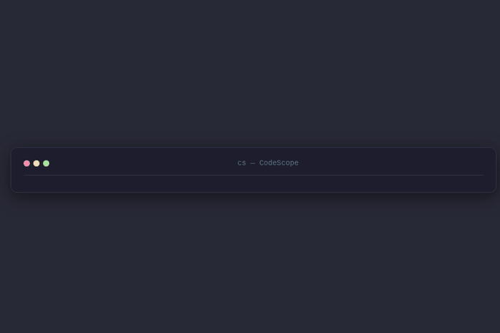

<p align="center">
  
</p>

<p align="center">
  
  
  
  
  
  
</p>

<h1 align="center">CodeScope</h1>

<p align="center">
  <strong>Repository Intelligence Engine for AI & Developers</strong><br>
  Make repositories understandable instantly — fast, deterministic, and AI-ready.
</p>

<p align="center">
  
</p>

<p align="center">
  <a href="#why-codescope">Why</a> ·
  <a href="#features">Features</a> ·
  <a href="#installation">Install</a> ·
  <a href="#quick-start">Quick Start</a> ·
  <a href="#commands">Commands</a> ·
  <a href="#ai-integration">AI Integration</a> ·
  <a href="#architecture">Architecture</a> ·
  <a href="#roadmap">Roadmap</a>
</p>

---

## Why CodeScope?

Large codebases are hard to understand — for humans navigating unfamiliar code, and for AI agents that need precise context to be effective. Existing tools solve pieces of the problem:

| Tool | Does one thing well | But misses... |
|------|---------------------|---------------|
| `ripgrep` | Fast content search | No symbol intelligence, no context |
| `fd` | File finding | No content, no definitions |
| `ctags` | Symbol indexing | Stale, no ranking, not AI-ready |
| `LSP` | Editor navigation | Not scriptable, editor-bound |
| `Sourcegraph` | Code intelligence | Cloud-only, not local-first |

**CodeScope bridges all of these gaps** in a single ~2 MB binary. File search, content search, symbol intelligence, dependency graphing, context extraction, and AI agent integration — all in one tool, local-first, zero runtime dependencies, deterministic results every time.

### Core Principles

| Principle | What it means |
|-----------|---------------|
| **Deterministic** | Same query, same results — always. No randomness, no approximation. |
| **Blazing fast** | Rust-native with rayon parallelism. Built for large repos (100k+ files). |
| **Scriptable** | Every command outputs structured JSON (`-j`), perfect for pipes and automation. |
| **AI-consumable** | Stable schemas, ranked results, context extraction built for LLM prompt packing. |
| **Local-first** | No cloud, no API keys, no network. Everything runs on your machine. |
| **Zero dependencies** | One static binary. No runtime, no JVM, no Node. Just `cs`. |

---

## Features

CodeScope packs **25 commands** across six capability pillars into a single binary.

### 1. Search & Navigation

Find anything in your repository in milliseconds.

| Command | Description |
|---------|-------------|
| `cs file <pattern>` | Fuzzy file name search with extension filter, depth limit, interactive mode |
| `cs content <pattern>` | Content search with fuzzy, exact, and regex modes. Rayon-parallelized |
| `cs web <query>` | Search DuckDuckGo directly from the terminal |
| `cs across <pattern>` | Cross-repository search across workspaces |
| `cs open <pattern>` | Find and open files in `$EDITOR` at the right line |
| `cs where <name>` | Jump to function/class/struct definitions across 7+ languages |
| `cs recent [options]` | Find recently modified files with time-based filtering |

### 2. Symbol Intelligence

Understand code structure without an IDE.

| Command | Description |
|---------|-------------|
| `cs symbol <name>` | Find symbol definitions with metadata (kind, language, file, line) |
| `cs refs <name>` | Find all references to a symbol (excluding definitions) |
| `cs callers <name>` | Find all functions that call a specific function (call graph) |
| `cs symbols [path]` | List all symbols in a file or directory with kind filtering |

### 3. Context Engine

The killer feature for AI coding — intelligent context extraction.

| Command | Description |
|---------|-------------|
| `cs context <topic>` | Multi-source context extraction (files, symbols, dependencies) with ranking |
| `cs pack <description>` | LLM-optimized prompt packing with token budget awareness |
| `cs trace <symbol>` | Trace execution flow through function calls |

### 4. Dependency Graph

See how your code connects.

| Command | Description |
|---------|-------------|
| `cs graph` | Module import dependency graph (tree, flat, DOT, or JSON) |
| `cs impact <target>` | Impact analysis — what depends on this file/symbol? |

### 5. Developer Tools

Utilities that make daily development smoother.

| Command | Description |
|---------|-------------|
| `cs stats` | Per-language file/line statistics with JSON output |
| `cs explain <pattern>` | Explain regex patterns in plain language |
| `cs history` | Persistent search history with auto-rotation |
| `cs config` | Display current configuration and config file path |
| `cs completions` | Shell completions for bash, zsh, fish, powershell, elvish |
| `cs schema` | Print JSON output schema for any command |

### 6. AI Agent Integration

| Command | Description |
|---------|-------------|
| `cs serve --mcp` | MCP (Model Context Protocol) server via stdio/JSON-RPC 2.0 |
| `cs serve` | HTTP API for programmatic access |

---

## Installation

### Download prebuilt binary

Download from [GitHub Releases](https://github.com/Arga-Wicaksono/codescope/releases/latest):

| Platform | Binary |
|----------|--------|
| Linux x86_64 | `cs-x86_64-linux` |
| macOS Intel | `cs-x86_64-macos` |
| macOS Apple Silicon | `cs-aarch64-macos` |
| Windows | `cs-x86_64-windows.exe` |

```bash
# Linux / macOS
curl -sL https://github.com/Arga-Wicaksono/codescope/releases/latest/download/cs-x86_64-linux -o cs && chmod +x cs && sudo mv cs /usr/local/bin/

# Or install from source
cargo install --git https://github.com/Arga-Wicaksono/codescope.git
```

### Build from source

```bash
git clone https://github.com/Arga-Wicaksono/codescope.git
cd codescope
cargo install --path .
```

### Build variants

```bash
# Full build (web search + interactive) — default
cargo build --release

# Without web search (smaller binary)
cargo build --release --no-default-features --features interactive

# Minimal: file + content only (smallest binary)
cargo build --release --no-default-features
```

---

## Quick Start

```bash
# Understand a project instantly
cs stats                            # Project composition by language
cs file "config" -I                 # Fuzzy-find config files interactively
cs content "fn main" -n -C 2        # Search with context

# Navigate code like a pro
cs where "parse_config"             # Jump to definition
cs symbol "UserService"             # Find symbol with metadata
cs open "main" --line 42            # Open file at exact line
cs recent --type rust --since '2h'  # What changed recently?

# Understand relationships
cs graph                            # Module dependency graph
cs impact utils.rs                  # What depends on utils.rs?
cs callers "validate_token"         # Who calls this function?
cs refs "UserService"               # Where is this symbol used?

# Get AI-ready structured output
cs context auth                     # Multi-source context for "auth"
cs pack "authentication bug"        # Token-efficient prompt packing
cs trace "login_user"               # Execution flow tracing
cs content "auth" --type rust -j    # JSON output for scripts/AI

# Search across repositories
cs across "TODO" --workspace ~/projects   # Find across all repos
cs explain '\s+\w+'                      # Understand regex patterns
cs web "rust async tutorial" -l 5         # Web search from terminal
```

---

## Commands

### Search & Navigation

#### `cs file <pattern>` — File Search

Find files by name using fuzzy matching (SkimMatcherV2).

```bash
cs file "Cargo"           # Basic fuzzy search
cs file "main" -e rs      # Filter by extension
cs file "test" --depth 2  # Limit recursion depth
cs file "config" -I       # Interactive selection
cs file "config" -j       # JSON output (AI-ready)
```

#### `cs content <pattern>` — Content Search

Search text inside files with three matching modes. Uses **rayon** for parallel processing.

```bash
cs content "function"         # Fuzzy search (default)
cs content "fn\s+\w+" --regex # Regex search
cs content "config" -x        # Exact substring match
cs content "TODO" -n          # Show line numbers
cs content "error" -C 3       # 3 context lines
cs content "TODO" --count     # Per-file match counts
cs content "fn" --invert      # Non-matching lines
cs content "auth" -j          # Structured JSON output
cs content "old" --replace "new" --write  # Find and replace
```

#### `cs where <name>` — Find Definitions

```bash
cs where 'parse_config'   # Search all source files
cs where 'MyStruct' --type rust
cs where 'handler' --open  # Find + open at definition line
cs where 'Handler' -j      # JSON output for AI consumption
```

Supports: Rust, Python, JS/TS, Go, Java/Kotlin, C/C++.

#### `cs open <pattern>` — Search + Open in Editor

```bash
cs open 'main'             # Find and open best match
cs open 'config' --line 42  # Open at specific line
cs open 'TODO' -I           # Interactive select, then open
```

#### `cs recent [options]` — Recently Modified Files

```bash
cs recent                  # 20 most recent files
cs recent --type rust      # Rust files only
cs recent --since '2h'     # Modified in last 2 hours
cs recent --open           # Open most recent in editor
```

#### `cs across <pattern>` — Cross-Repository Search

```bash
cs across 'TODO' --workspace ~/projects    # Auto-discover git repos
cs across 'error' --repos /a/repo1,/b/repo2
```

#### `cs web <query>` — Web Search

```bash
cs web "rust tutorial" -l 5   # Search DuckDuckGo from terminal
cs web "async await" -j        # JSON output
```

### Symbol Intelligence

#### `cs symbol <name>` — Find Symbol Definitions

```bash
cs symbol UserService              # Find symbol definition
cs symbol authenticate --type rust  # Filter by language
cs symbol login -j                 # JSON with metadata
cs symbol Handler --kind function  # Filter by kind
```

Kinds: `function`, `method`, `class`, `struct`, `trait`, `interface`, `enum`, `module`, `constant`, `type`.

#### `cs refs <name>` — Find References

```bash
cs refs login_user           # All references (not definitions)
cs refs UserService -n       # With line numbers
cs refs authenticate -j      # Structured JSON
```

#### `cs callers <name>` — Find Callers

```bash
cs callers validate_token     # Who calls this function?
cs callers parse_config -n    # With line numbers and context
cs callers handle_request -j  # JSON output
```

#### `cs symbols [path]` — List All Symbols

```bash
cs symbols                    # All symbols in current directory
cs symbols src/auth/mod.rs    # Symbols in a specific file
cs symbols --kind struct      # Only structs and classes
cs symbols --type rust -j     # Rust symbols as JSON
```

### Context Engine

#### `cs context <topic>` — Multi-Source Context

Extract ranked context from files, symbols, and dependencies.

```bash
cs context auth               # Context for "auth" topic
cs context "error handling"   # Multi-word topic
cs context auth --tokens 4000 # Token budget limit
cs context auth -j            # JSON with ranking scores
```

#### `cs pack <description>` — LLM Prompt Packing

Pack context into a token-efficient format optimized for LLM prompts.

```bash
cs pack "authentication bug"          # Pack context for this description
cs pack "login flow" --budget 8000    # Token budget control
cs pack "user service" -j             # JSON output
```

#### `cs trace <symbol>` — Execution Flow Tracing

Trace the execution flow through function calls.

```bash
cs trace login_user          # Trace call chain
cs trace handle_request -j   # JSON output with flow
```

### Dependency Graph

#### `cs graph` — Dependency Graph

Build and display module import or function call graphs.

```bash
cs graph                     # Module import graph (tree view)
cs graph --type calls        # Function call graph
cs graph --format flat       # Flat edge list
cs graph --format dot        # Graphviz DOT output
cs graph -j                  # JSON with nodes and edges
cs graph --depth 3           # Limit recursion depth
```

Pipes directly into Graphviz for visualization:

```bash
cs graph --format dot | dot -Tpng -o graph.png
cs graph --format dot | dot -Tsvg -o graph.svg
```

#### `cs impact <target>` — Impact Analysis

Analyze what would be affected if you modify a file or module.

```bash
cs impact utils.rs           # What depends on utils.rs?
cs impact auth               # Impact on "auth" module
cs impact "src/lib.rs" -j    # JSON output
```

### Developer Tools

#### `cs stats [options]` — File Statistics

```bash
cs stats                   # Current directory stats
cs stats --type rust       # Rust files only
cs stats -j                # JSON output (AI-ready)
```

#### `cs explain <pattern>` — Explain Regex

```bash
cs explain '\s+\w+'         # Explains each token
cs explain '[A-Z][a-z]+'
```

#### `cs schema <command>` — JSON Schema

Print the JSON output schema for any command, useful for AI integration and documentation.

```bash
cs schema file             # Schema for `cs file -j`
cs schema content          # Schema for `cs content -j`
cs schema symbol           # Schema for `cs symbol -j`
```

---

## Matching Modes

| Mode | Flag | Best For |
|------|------|----------|
| **Fuzzy** | *(default)* | Approximate matching, tolerates typos |
| **Exact** | `-x` / `--exact` | Precise substring, zero false positives |
| **Regex** | `--regex` | Full pattern power |

---

## JSON Output (`-j`)

Every command supports structured JSON output via the `-j` flag. This is the foundation for AI integration and scripting:

```bash
# Human-readable
$ cs content "auth" --type rust -n
src/auth/mod.rs:15:pub fn authenticate(token: &str) -> Result<User>
src/auth/handler.rs:8:async fn auth_handler(req: Request) -> Response

# Same query, AI-ready JSON
$ cs content "auth" --type rust -n -j
{"results":[{"file":"src/auth/mod.rs","line":15,"content":"pub fn authenticate(token: &str) -> Result<User>"},{"file":"src/auth/handler.rs","line":8,"content":"async fn auth_handler(req: Request) -> Response"}],"count":2,"query":"auth"}
```

Use `cs schema <command>` to get the exact JSON schema for any command.

---

## Exit Codes

| Code | Meaning |
|------|---------|
| `0` | Results found |
| `1` | No results found |
| `2` | Error |

---

## AI Integration

CodeScope is designed as **infrastructure for AI agents**. Three integration paths are available.

### MCP Protocol (Recommended)

CodeScope includes a built-in [Model Context Protocol](https://modelcontextprotocol.io/) server, compatible with Claude Desktop, Cursor, and any MCP-compatible AI client.

```json
// claude_desktop_config.json
{
  "mcpServers": {
    "codescope": {
      "command": "cs",
      "args": ["serve", "--mcp", "--path", "/path/to/repo"]
    }
  }
}
```

**10 MCP tools** are exposed:

| Tool | Description |
|------|-------------|
| `search_files` | Fuzzy file search by name |
| `search_content` | Search text content inside files |
| `find_symbol` | Find symbol definitions with metadata |
| `find_references` | Find all references to a symbol |
| `find_callers` | Find callers of a function |
| `list_symbols` | List all symbols in a file or directory |
| `get_context` | Extract ranked context for a topic |
| `pack_context` | Pack context for LLM prompts |
| `trace_symbol` | Trace execution flow through calls |
| `repo_stats` | Repository statistics by language |

### HTTP API

```bash
# Start the HTTP API
cs serve --port 4567 --path /path/to/repo

# Query endpoints
curl "http://localhost:4567/search?q=auth&type=rust"
curl "http://localhost:4567/symbol?name=UserService"
curl "http://localhost:4567/context?q=authentication&tokens=4000"
curl "http://localhost:4567/stats"
```

### HTTP Bridge (Python)

For environments where the Rust HTTP server needs additional flexibility, a Python HTTP bridge is included in `scripts/`:

```bash
# Start the bridge
./scripts/cs-bridge.sh start /path/to/repo --port 4567

# Query
curl "http://localhost:4567/search?q=auth&type=rust"
curl "http://localhost:4567/symbol?name=UserService"
curl "http://localhost:4567/context?q=auth&tokens=4000"

# Stop
./scripts/cs-bridge.sh stop
```

The bridge exposes **12 REST endpoints**: `/health`, `/search`, `/files`, `/symbol`, `/refs`, `/callers`, `/symbols`, `/context`, `/pack`, `/trace`, `/stats`, `/where`.

### One-Shot MCP Client

For scripting and automation, use the included MCP client:

```bash
./scripts/cs-mcp.sh search_files '{"pattern": "config"}'
./scripts/cs-mcp.sh find_symbol '{"name": "UserService"}'
./scripts/cs-mcp.sh pack_context '{"description": "auth bug", "budget": 8000}'
```

---

## Architecture

```
┌──────────────────────────────────────────────┐
│                 Repository                    │
│  (files, symbols, dependencies, git history) │
└──────────────────┬───────────────────────────┘
                   │
          ┌────────▼────────┐
          │    CodeScope     │
          │    (cs binary)   │
          │                  │
          │  ┌────────────┐  │
          │  │ File Search │  │
          │  │ Content S.  │  │
          │  │ Symbol Intel│  │
          │  │ Context Eng.│  │
          │  │ Dep Graph   │  │
          │  │ MCP Server  │  │
          │  └────────────┘  │
          └────────┬────────┘
                   │
       ┌───────────┼───────────┐
       │                       │
  ┌────▼─────┐          ┌──────▼──────┐
  │ Developer │          │  AI Agent   │
  │  (CLI)   │          │ (MCP/HTTP)  │
  │ Terminal │          │ JSON / Pipe │
  └──────────┘          └─────────────┘
```

### Design Philosophy

CodeScope is a **pipeline tool**, not a platform. It takes a repository as input and produces structured context as output. This makes it composable — you can pipe `cs` output into any AI agent, CI/CD pipeline, or custom script.

**Today:** File search, content search, symbol intelligence, dependency graph, context engine, MCP protocol.
**Next:** TUI mode, performance benchmarks, plugin architecture.
**Never:** AI chatbot, code generation, cloud platform. CodeScope is infrastructure.

---

## Comparison

| Feature | `cs` | `fd` | `rg` | `fzf` | `ctags` | LSP |
|---------|------|------|------|-------|---------|-----|
| Fuzzy file search | Yes | Yes | No | Yes | No | No |
| Content search | Fuzzy + exact + regex | No | Regex only | No | No | Yes |
| Symbol intelligence | Grammar-based (12+ langs) | No | No | No | Stale | Yes |
| Call graph | Yes (`cs graph --type calls`) | No | No | No | No | Partial |
| Dependency graph | Yes (`cs graph`, `cs impact`) | No | No | No | No | No |
| Context extraction | Yes (`cs context`, `cs pack`) | No | No | No | No | No |
| Cross-repo search | Yes | No | No | No | No | No |
| JSON output | Yes (`-j`) | No | No | No | No | No |
| MCP protocol | Yes | No | No | No | No | No |
| AI-ready context | Yes | No | No | No | No | No |
| Interactive mode | Built-in (`-I`) | Via pipe | Via pipe | Yes | No | Editor |
| Local-first | Yes | Yes | Yes | Yes | Yes | Yes |
| Zero runtime deps | Yes | Yes | Yes | Yes | Yes | No |
| Written in | Rust | Rust | Rust | Go | C | Various |

---

## Configuration

Create `~/.codescope.json` for persistent defaults:

```json
{
  "default_limit": 50,
  "default_depth": 5,
  "color": true,
  "web_timeout": 15
}
```

---

## Running Tests

```bash
cargo test
```

---

## Roadmap

See [docs/ROADMAP.md](docs/ROADMAP.md) for the full development roadmap.

**Completed phases:**
- Phase 1 — Repositioning
- Phase 2 — Structured JSON Output
- Phase 3 — Symbol Intelligence
- Phase 4 — Context Engine
- Phase 5 — Dependency Graph
- Phase 7 — MCP Protocol Server

**Upcoming:**
- Phase 6 — TUI Mode (ratatui + crossterm)
- Phase 8 — Performance Excellence (benchmarks, incremental indexing)
- Phase 9 — Open Source Ecosystem (SDK, plugins, editor extensions)

---

## Contributing

Contributions are welcome! See [CONTRIBUTING.md](CONTRIBUTING.md) for guidelines.

## Changelog

See [CHANGELOG.md](CHANGELOG.md) for release history.

## License

MIT License — see [LICENSE](LICENSE) for details.

---

<p align="center">
  <strong>Repository Intelligence Infrastructure for the AI Coding Era</strong><br>
  Built with Rust by <a href="https://github.com/Arga-Wicaksono">Arga Wicaksono</a> ·
  <a href="https://github.com/Arga-Wicaksono/codescope">GitHub</a> ·
  <a href="https://github.com/Arga-Wicaksono/codescope/releases">Releases</a> ·
  <a href="docs/ROADMAP.md">Roadmap</a>
</p>
